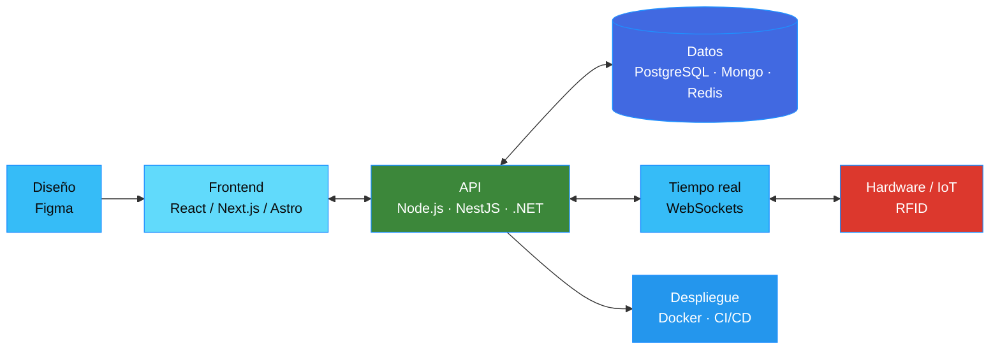

	

<h3 align="center">
	<samp>
		&gt; Hola, soy
		<b><a target="_blank" rel="noreferrer" href="https://www.linkedin.com/in/germankreibohmacotto/">Germán Kreibohm Acotto</a></b>
	</samp>
</h3>

	

	
	
	
	
	

	

	

## 👋 Sobre mí

Soy Desarrollador Full-Stack con experiencia en el diseño e implementación de **sistemas integrales** (Web, Mobile y Backend), integrando comunicación en tiempo real y hardware (RFID/IoT). Mi foco está en diseñar arquitecturas escalables, adaptándome a cualquier stack técnico para llevar ideas desde el diseño hasta su puesta en producción.

🟢 Disponible para nuevos proyectos y oportunidades.

	

## 🧰 Stack técnico

**Lenguajes**

**Frontend**

**Backend**

**Datos**

**Infra & tiempo real**

**CMS & e-commerce**

**Herramientas**

	

## 🏗️ Cómo trabajo

	

## 🚀 Proyectos destacados

| Proyecto | Descripción | Stack | Links |
|---|---|---|---|
| **Sistema de Logs en Tiempo Real** | Plataforma self-hosted para centralizar logs: streaming por WebSocket, búsqueda histórica, alertas por umbral y exportación a CSV/JSON/NDJSON | Fastify · React · PostgreSQL · Redis · WebSockets · Docker | [Repo](https://github.com/GermanKreibohmAcotto/Sistema-de-Logs-en-tiempo-real) |
| **HookEngine** | Motor de entrega de webhooks tolerante a fallos: ingesta no bloqueante, cola con reintentos y backoff, firma HMAC-SHA256 y dead-letter queue | TypeScript · Node.js · PostgreSQL · Redis · BullMQ · Docker | [Repo](https://github.com/GermanKreibohmAcotto/HookEngine) |
| **CrashCamisetas** | Catálogo de camisetas de fútbol con pedidos por WhatsApp y panel administrativo para gestionar productos, categorías e inventario por talle | Next.js · TypeScript · Supabase · PostgreSQL · Tailwind CSS | [Sitio](https://crashcamisetas.vercel.app) · [Repo](https://github.com/GermanKreibohmAcotto/CrashCamisetas) |
| **Sistema RFID para restaurantes** | Ecosistema integral (web/móvil/IoT) para gestión gastronómica y pagos con tarjetas RFID | React Native · Node.js · MariaDB · WebSockets · RFID/IoT | — |
| **Ampere** | Landing page para empresa de materiales eléctricos e iluminación en Argentina | WordPress · HTML5 · CSS3 · JavaScript · PHP | [Sitio](https://www.ampere.com.ar/) |
| **ViaScooter** | E-commerce para venta online de motos y accesorios en España | WordPress · Elementor · WooCommerce · SEO | [Sitio](https://viascooter.es/) |

	

## 📊 Estadísticas

	
	

	

	

	

## 💼 Experiencia y formación

<strong>Experiencia laboral</strong>

 

**Desarrollador Full Stack — Thalú** · 2025 - Presente
Impulso del crecimiento digital mediante el desarrollo de plataformas web personalizadas que lograron incrementar la captación de clientes en un 40%. Interfaces interactivas y Custom Themes, optimización de paneles administrativos en WordPress, creación de plugins a medida e implementación de código modular.

**Desarrollador Full Stack — Radix Web Argentina** · 2024 - Presente
Optimización de la arquitectura backend con Node.js y principios SOLID, reduciendo los tiempos de respuesta en un 30%. Interfaces escalables en React, estrategias avanzadas de SEO técnico en WordPress, análisis de métricas en Google Analytics y optimización de tasas de conversión.

<strong>Educación y certificaciones</strong>

 

- **Tecnicatura Universitaria en Programación** — Universidad Tecnológica Nacional (UTN), 2024 - 2026
- **Desarrollador Web FullStack MERN** — RollingCode, 2023 - 2024
- **Full Stack Desarrollo Web (JavaScript · Node.js · SQL)** — Codo a Codo 4.0, 2022
- **Desarrollo Web** — CoderHouse, 2022
- **Programación Web** — Universidad Tecnológica Nacional (UTN), 2022

	

## 🫂 Conectemos

  
  
  

	

